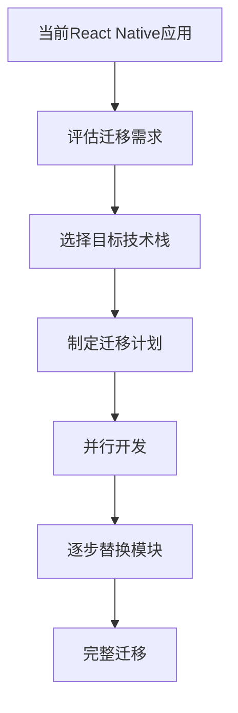

# 自主钱包开发技术方案对比分析

## 概述

除了 React Native + Expo 架构外，还有多种技术方案可以用于自主钱包开发。本文档将详细分析各种替代方案，包括原生开发、Flutter、智能合约钱包、MPC钱包等，并提供具体的技术选型建议。

## 技术方案详细对比

### 1. 原生开发方案

#### 1.1 Android 原生开发 (Kotlin/Java)

**技术栈:**
- **语言**: Kotlin (推荐) / Java
- **UI框架**: Jetpack Compose / XML Layouts
- **区块链交互**: Web3j / Ethers4j
- **安全存储**: Android Keystore
- **加密**: Android Security Library

**核心代码示例:**
```kotlin
// 钱包创建
class WalletManager {
    fun createWallet(): Wallet {
        val keyPair = ECKeyPair.create(ECKeyPair.generateNewKeyPair())
        val credentials = Credentials.create(keyPair)
        return Wallet(credentials.address, credentials.ecKeyPair)
    }
    
    fun importWallet(privateKey: String): Wallet {
        val credentials = Credentials.create(privateKey)
        return Wallet(credentials.address, credentials.ecKeyPair)
    }
}

// 安全存储
class SecureStorage {
    private val keyStore = KeyStore.getInstance("AndroidKeyStore")
    
    fun storePrivateKey(address: String, privateKey: String) {
        val keyGenerator = KeyGenerator.getInstance(KeyProperties.KEY_ALGORITHM_AES, "AndroidKeyStore")
        val keyGenParameterSpec = KeyGenParameterSpec.Builder(
            "wallet_$address",
            KeyProperties.PURPOSE_ENCRYPT or KeyProperties.PURPOSE_DECRYPT
        )
            .setBlockModes(KeyProperties.BLOCK_MODE_GCM)
            .setEncryptionPaddings(KeyProperties.ENCRYPTION_PADDING_NONE)
            .setUserAuthenticationRequired(true)
            .build()
        
        keyGenerator.init(keyGenParameterSpec)
        keyGenerator.generateKey()
    }
}
```

**优势:**
- 🚀 **最佳性能**: 直接调用原生API，无中间层开销
- 🔒 **完整安全支持**: 完整的生物识别、硬件安全模块支持
- 🎯 **深度平台集成**: 可访问所有Android特有功能
- 📱 **最佳用户体验**: 完全符合Material Design规范

**劣势:**
- 💰 **开发成本高**: 需要Android专业开发团队
- ⏰ **开发周期长**: 单独开发Android版本
- 🔧 **维护复杂**: 需要维护独立的代码库
- 📚 **学习成本**: 需要掌握Kotlin/Java和Android生态

**适用场景:**
- 大型企业级项目
- 对性能要求极高的应用
- 需要深度Android集成的功能
- 有充足开发资源的项目

#### 1.2 iOS 原生开发 (Swift)

**技术栈:**
- **语言**: Swift
- **UI框架**: SwiftUI / UIKit
- **区块链交互**: Web3.swift / Ethers.swift
- **安全存储**: iOS Keychain
- **加密**: CryptoKit

**核心代码示例:**
```swift
import CryptoKit
import Security

class WalletManager {
    func createWallet() -> Wallet {
        let privateKey = P256.Signing.PrivateKey()
        let publicKey = privateKey.publicKey
        let address = generateAddress(from: publicKey)
        return Wallet(address: address, privateKey: privateKey)
    }
    
    func importWallet(privateKeyData: Data) throws -> Wallet {
        let privateKey = try P256.Signing.PrivateKey(rawRepresentation: privateKeyData)
        let publicKey = privateKey.publicKey
        let address = generateAddress(from: publicKey)
        return Wallet(address: address, privateKey: privateKey)
    }
}

class KeychainManager {
    func storePrivateKey(_ privateKey: Data, for address: String) throws {
        let query: [String: Any] = [
            kSecClass as String: kSecClassGenericPassword,
            kSecAttrAccount as String: address,
            kSecValueData as String: privateKey,
            kSecAttrAccessControl as String: SecAccessControlCreateWithFlags(
                kCFAllocatorDefault,
                kSecAttrAccessibleWhenUnlockedThisDeviceOnly,
                .biometryAny,
                nil
            )!
        ]
        
        let status = SecItemAdd(query as CFDictionary, nil)
        guard status == errSecSuccess else {
            throw KeychainError.storeFailed
        }
    }
}
```

**优势:**
- 🚀 **最佳性能**: 原生Swift性能
- 🔒 **完整安全支持**: Face ID、Touch ID、Secure Enclave
- 🎨 **优秀UI体验**: 完全符合iOS设计规范
- 🔧 **丰富工具链**: Xcode、Instruments等专业工具

**劣势:**
- 💰 **开发成本高**: 需要iOS专业开发团队
- ⏰ **开发周期长**: 单独开发iOS版本
- 🔧 **维护复杂**: 需要维护独立的代码库
- 📚 **学习成本**: 需要掌握Swift和iOS生态

### 2. Flutter 跨平台方案

**技术栈:**
- **语言**: Dart
- **UI框架**: Flutter Widgets
- **区块链交互**: web3dart
- **状态管理**: Provider / Riverpod / Bloc
- **安全存储**: flutter_secure_storage

**核心代码示例:**
```dart
import 'package:web3dart/web3dart.dart';
import 'package:flutter_secure_storage/flutter_secure_storage.dart';

class WalletService {
  final Web3Client _client;
  final FlutterSecureStorage _storage;
  
  WalletService(this._client, this._storage);
  
  Future<Wallet> createWallet() async {
    final credentials = EthPrivateKey.createRandom(Random.secure());
    final address = credentials.address;
    
    // 安全存储私钥
    await _storage.write(
      key: 'wallet_$address',
      value: credentials.privateKey.toString(),
    );
    
    return Wallet(
      address: address,
      privateKey: credentials.privateKey,
    );
  }
  
  Future<Wallet> importWallet(String privateKey) async {
    final credentials = EthPrivateKey.fromHex(privateKey);
    final address = credentials.address;
    
    await _storage.write(
      key: 'wallet_$address',
      value: credentials.privateKey.toString(),
    );
    
    return Wallet(
      address: address,
      privateKey: credentials.privateKey,
    );
  }
  
  Future<String> sendTransaction({
    required String to,
    required EtherAmount amount,
    required Credentials credentials,
  }) async {
    final transaction = Transaction(
      to: EthereumAddress.fromHex(to),
      value: amount,
      gasPrice: EtherAmount.inWei(BigInt.from(20000000000)),
      maxGas: 21000,
    );
    
    final txHash = await _client.sendTransaction(
      credentials,
      transaction,
      chainId: 1,
    );
    
    return txHash;
  }
}

// UI组件示例
class WalletScreen extends StatelessWidget {
  @override
  Widget build(BuildContext context) {
    return Scaffold(
      appBar: AppBar(title: Text('我的钱包')),
      body: Consumer<WalletProvider>(
        builder: (context, walletProvider, child) {
          return Column(
            children: [
              _buildBalanceCard(walletProvider.balance),
              _buildActionButtons(context),
              _buildTransactionHistory(walletProvider.transactions),
            ],
          );
        },
      ),
    );
  }
  
  Widget _buildBalanceCard(String balance) {
    return Card(
      child: Padding(
        padding: EdgeInsets.all(16),
        child: Column(
          children: [
            Text('余额', style: Theme.of(context).textTheme.headline6),
            Text(balance, style: Theme.of(context).textTheme.headline4),
          ],
        ),
      ),
    );
  }
}
```

**优势:**
- 🎯 **高性能渲染**: 自建渲染引擎，60fps流畅体验
- 🎨 **UI一致性**: 在所有平台提供完全一致的UI
- 📱 **跨平台支持**: 一套代码支持iOS、Android、Web、Desktop
- 🔧 **热重载**: 快速开发迭代
- 📚 **丰富组件**: 大量预构建的Material Design和Cupertino组件

**劣势:**
- 📦 **包体积大**: 应用体积通常比原生应用大20-30%
- 🐛 **生态相对较新**: 第三方库数量和质量不如React Native
- 🔧 **原生功能限制**: 某些平台特有功能需要编写平台特定代码
- 📚 **学习成本**: 需要学习Dart语言

**适用场景:**
- 注重UI一致性的应用
- 有Dart开发经验的团队
- 需要高性能渲染的应用
- 跨平台需求强烈的项目

### 3. 智能合约钱包方案

#### 3.1 基于智能合约的账户抽象钱包

**技术栈:**
- **智能合约**: Solidity
- **前端**: React / Vue.js / Flutter
- **SDK**: Account Abstraction SDK
- **基础设施**: Biconomy / Stackup / Pimlico

**核心智能合约示例:**
```solidity
// SPDX-License-Identifier: MIT
pragma solidity ^0.8.19;

import "@openzeppelin/contracts/utils/cryptography/ECDSA.sol";
import "@openzeppelin/contracts/utils/cryptography/MessageHashUtils.sol";

contract SmartWallet {
    using ECDSA for bytes32;
    using MessageHashUtils for bytes32;
    
    address public owner;
    uint256 public nonce;
    mapping(address => bool) public guardians;
    
    event TransactionExecuted(address indexed to, uint256 value, bytes data);
    
    constructor(address _owner) {
        owner = _owner;
    }
    
    function execute(
        address to,
        uint256 value,
        bytes calldata data,
        bytes calldata signature
    ) external {
        bytes32 messageHash = keccak256(
            abi.encodePacked(
                "\x19\x01",
                domainSeparator(),
                keccak256(abi.encode(
                    keccak256("Execute(address to,uint256 value,bytes data,uint256 nonce)"),
                    to,
                    value,
                    keccak256(data),
                    nonce++
                ))
            )
        );
        
        address signer = messageHash.recover(signature);
        require(signer == owner, "Invalid signature");
        
        (bool success, ) = to.call{value: value}(data);
        require(success, "Transaction failed");
        
        emit TransactionExecuted(to, value, data);
    }
    
    function addGuardian(address guardian) external {
        require(msg.sender == owner, "Only owner");
        guardians[guardian] = true;
    }
    
    function recoverWallet(address newOwner, bytes calldata guardianSignatures) external {
        require(guardians[msg.sender], "Not a guardian");
        // 实现多签恢复逻辑
        owner = newOwner;
    }
    
    function domainSeparator() internal view returns (bytes32) {
        return keccak256(
            abi.encode(
                keccak256("EIP712Domain(string name,string version,uint256 chainId,address verifyingContract)"),
                keccak256(bytes("SmartWallet")),
                keccak256(bytes("1")),
                block.chainid,
                address(this)
            )
        );
    }
    
    receive() external payable {}
}
```

**前端集成示例:**
```javascript
import { ethers } from 'ethers';
import { BiconomySmartAccount } from '@biconomy/account';

class SmartWalletService {
  constructor() {
    this.smartAccount = null;
    this.provider = null;
  }
  
  async initializeSmartAccount(privateKey) {
    const provider = new ethers.JsonRpcProvider('https://polygon-rpc.com');
    const wallet = new ethers.Wallet(privateKey, provider);
    
    this.smartAccount = await BiconomySmartAccount.create({
      signer: wallet,
      chainId: 137, // Polygon
      bundlerUrl: 'https://bundler.biconomy.io/api/v2/137/nJPK7B3ru.dd7f7861-190d-41bd-af80-6877f74b8f44',
      paymasterApiKey: 'YOUR_PAYMASTER_API_KEY'
    });
    
    return this.smartAccount.getSmartAccountAddress();
  }
  
  async sendTransaction(to, amount, data = '0x') {
    const transaction = {
      to: to,
      value: ethers.parseEther(amount.toString()),
      data: data
    };
    
    const userOp = await this.smartAccount.buildUserOp([transaction]);
    const userOpResponse = await this.smartAccount.sendUserOp(userOp);
    
    return userOpResponse;
  }
  
  async batchTransactions(transactions) {
    const userOp = await this.smartAccount.buildUserOp(transactions);
    const userOpResponse = await this.smartAccount.sendUserOp(userOp);
    
    return userOpResponse;
  }
}
```

**优势:**
- 🔒 **高级安全功能**: 多签、社交恢复、权限管理
- 💰 **Gas优化**: 批量交易、Gas赞助
- 🎯 **用户体验**: 无Gas交易、社交登录
- 🔧 **可编程性**: 自定义业务逻辑

**劣势:**
- 💰 **Gas费用**: 智能合约操作需要支付Gas
- 🔧 **复杂性**: 开发和维护智能合约需要专业知识
- 📚 **学习成本**: 需要理解账户抽象概念
- 🐛 **生态较新**: 相关工具和文档相对较少

### 4. MPC (多方安全计算) 钱包方案

#### 4.1 基于MPC的密钥管理

**技术栈:**
- **MPC协议**: TSS (Threshold Signature Scheme)
- **前端**: React / Flutter
- **后端**: Node.js / Python
- **SDK**: Web3Auth / Particle Network

**核心实现示例:**
```javascript
import { Web3Auth } from '@web3auth/modal';
import { CHAIN_NAMESPACES } from '@web3auth/base';

class MPCWalletService {
  constructor() {
    this.web3auth = new Web3Auth({
      clientId: 'YOUR_CLIENT_ID',
      chainConfig: {
        chainNamespace: CHAIN_NAMESPACES.EIP155,
        chainId: '0x1', // Ethereum
        rpcTarget: 'https://mainnet.infura.io/v3/YOUR_INFURA_KEY',
      },
    });
  }
  
  async initialize() {
    await this.web3auth.init();
  }
  
  async login() {
    const web3authProvider = await this.web3auth.connect();
    const provider = new ethers.providers.Web3Provider(web3authProvider);
    const signer = provider.getSigner();
    const address = await signer.getAddress();
    
    return {
      address,
      signer,
      provider
    };
  }
  
  async sendTransaction(to, amount) {
    const { signer } = await this.getWallet();
    
    const transaction = {
      to: to,
      value: ethers.utils.parseEther(amount.toString()),
      gasLimit: 21000
    };
    
    const tx = await signer.sendTransaction(transaction);
    return tx;
  }
  
  async logout() {
    await this.web3auth.logout();
  }
}

// React组件示例
function MPCWalletComponent() {
  const [wallet, setWallet] = useState(null);
  const [loading, setLoading] = useState(false);
  
  const handleLogin = async () => {
    setLoading(true);
    try {
      const walletData = await mpcWalletService.login();
      setWallet(walletData);
    } catch (error) {
      console.error('Login failed:', error);
    } finally {
      setLoading(false);
    }
  };
  
  const handleSendTransaction = async (to, amount) => {
    try {
      const tx = await mpcWalletService.sendTransaction(to, amount);
      console.log('Transaction sent:', tx.hash);
    } catch (error) {
      console.error('Transaction failed:', error);
    }
  };
  
  return (
    <div>
      {!wallet ? (
        <button onClick={handleLogin} disabled={loading}>
          {loading ? '登录中...' : '登录钱包'}
        </button>
      ) : (
        <div>
          <p>地址: {wallet.address}</p>
          <button onClick={() => handleSendTransaction('0x...', 0.1)}>
            发送交易
          </button>
        </div>
      )}
    </div>
  );
}
```

**优势:**
- 🔒 **增强安全性**: 私钥分片存储，无单点故障
- 👥 **社交恢复**: 支持社交登录和恢复
- 🎯 **用户体验**: 无需管理助记词
- 🔧 **企业级**: 适合企业级应用

**劣势:**
- 💰 **成本较高**: 需要第三方服务费用
- 🔧 **依赖性强**: 依赖第三方MPC服务
- 📚 **技术复杂**: 需要理解MPC协议
- 🐛 **生态限制**: 可选择的MPC服务商有限

### 5. 其他跨平台方案

#### 5.1 Ionic + Capacitor

**技术栈:**
- **前端**: Angular / React / Vue
- **移动端**: Capacitor
- **UI组件**: Ionic Components
- **区块链交互**: ethers.js

**核心代码示例:**
```typescript
import { Component } from '@angular/core';
import { Storage } from '@ionic/storage-angular';
import { ethers } from 'ethers';

@Component({
  selector: 'app-wallet',
  templateUrl: './wallet.page.html',
  styleUrls: ['./wallet.page.scss'],
})
export class WalletPage {
  wallet: any = null;
  balance: string = '0';
  
  constructor(private storage: Storage) {}
  
  async createWallet() {
    const wallet = ethers.Wallet.createRandom();
    await this.storage.set('wallet', {
      address: wallet.address,
      privateKey: wallet.privateKey
    });
    this.wallet = wallet;
  }
  
  async loadWallet() {
    const walletData = await this.storage.get('wallet');
    if (walletData) {
      this.wallet = new ethers.Wallet(walletData.privateKey);
    }
  }
  
  async getBalance() {
    if (this.wallet) {
      const provider = new ethers.providers.JsonRpcProvider('https://mainnet.infura.io/v3/YOUR_KEY');
      const balance = await provider.getBalance(this.wallet.address);
      this.balance = ethers.utils.formatEther(balance);
    }
  }
}
```

**优势:**
- 🌐 **Web技术**: 使用熟悉的Web技术栈
- 🔧 **快速开发**: 开发效率高
- 📱 **跨平台**: 支持多平台

**劣势:**
- 🐌 **性能较低**: WebView性能限制
- 🎨 **UI体验**: 不如原生应用流畅
- 🔧 **功能限制**: 某些原生功能支持有限

#### 5.2 Xamarin

**技术栈:**
- **语言**: C#
- **框架**: Xamarin.Forms / Xamarin.Native
- **区块链交互**: Nethereum
- **UI**: XAML

**核心代码示例:**
```csharp
using Nethereum.Web3;
using Nethereum.Web3.Accounts;

public class WalletService
{
    private Web3 _web3;
    private Account _account;
    
    public async Task<Account> CreateWalletAsync()
    {
        var ecKey = Nethereum.Signer.EthECKey.GenerateKey();
        _account = new Account(ecKey);
        
        _web3 = new Web3(_account, "https://mainnet.infura.io/v3/YOUR_KEY");
        
        return _account;
    }
    
    public async Task<string> SendTransactionAsync(string to, decimal amount)
    {
        var transaction = await _web3.Eth.GetEtherTransferService()
            .TransferEtherAndWaitForReceiptAsync(to, amount);
        
        return transaction.TransactionHash;
    }
    
    public async Task<decimal> GetBalanceAsync()
    {
        var balance = await _web3.Eth.GetBalance.SendRequestAsync(_account.Address);
        return Web3.Convert.FromWei(balance);
    }
}
```

**优势:**
- 🔧 **C#统一**: 使用C#开发所有平台
- 🏢 **企业级**: 微软官方支持
- 📚 **.NET生态**: 丰富的.NET库支持

**劣势:**
- 📦 **包体积大**: 应用体积较大
- 🐛 **生态较小**: 社区资源相对较少
- 💰 **成本**: 需要Visual Studio许可证

## 技术方案选择矩阵

| 方案 | 开发效率 | 性能 | 安全性 | 维护成本 | 学习成本 | 生态支持 | 推荐指数 |
|------|----------|------|--------|----------|----------|----------|----------|
| **React Native + Expo** | ⭐⭐⭐⭐⭐ | ⭐⭐⭐⭐ | ⭐⭐⭐⭐ | ⭐⭐⭐⭐ | ⭐⭐⭐ | ⭐⭐⭐⭐⭐ | ⭐⭐⭐⭐⭐ |
| **Flutter** | ⭐⭐⭐⭐ | ⭐⭐⭐⭐⭐ | ⭐⭐⭐⭐ | ⭐⭐⭐⭐ | ⭐⭐ | ⭐⭐⭐ | ⭐⭐⭐⭐ |
| **原生开发** | ⭐⭐ | ⭐⭐⭐⭐⭐ | ⭐⭐⭐⭐⭐ | ⭐⭐ | ⭐ | ⭐⭐⭐⭐⭐ | ⭐⭐⭐ |
| **智能合约钱包** | ⭐⭐⭐ | ⭐⭐⭐ | ⭐⭐⭐⭐⭐ | ⭐⭐⭐ | ⭐ | ⭐⭐ | ⭐⭐⭐⭐ |
| **MPC钱包** | ⭐⭐⭐⭐ | ⭐⭐⭐⭐ | ⭐⭐⭐⭐⭐ | ⭐⭐⭐⭐ | ⭐⭐⭐ | ⭐⭐ | ⭐⭐⭐⭐ |
| **Ionic** | ⭐⭐⭐⭐⭐ | ⭐⭐ | ⭐⭐⭐ | ⭐⭐⭐⭐ | ⭐⭐⭐⭐ | ⭐⭐⭐ | ⭐⭐ |
| **Xamarin** | ⭐⭐⭐ | ⭐⭐⭐ | ⭐⭐⭐⭐ | ⭐⭐⭐ | ⭐⭐ | ⭐⭐ | ⭐⭐ |

## 具体推荐方案

### 🥇 第一推荐: Flutter

**适用场景:**
- 注重UI一致性和性能
- 有Dart开发经验或愿意学习
- 需要跨平台支持
- 对包体积不敏感

**技术栈建议:**
```yaml
# pubspec.yaml
dependencies:
  flutter: ^3.16.0
  web3dart: ^4.0.0
  flutter_secure_storage: ^9.0.0
  provider: ^6.1.0
  qr_flutter: ^4.1.0
  camera: ^0.10.5
  local_auth: ^2.1.6
```

**项目结构:**
```
lib/
├── models/          # 数据模型
├── services/        # 业务逻辑
├── providers/       # 状态管理
├── screens/         # 页面
├── widgets/         # 组件
└── utils/           # 工具类
```

### 🥈 第二推荐: 智能合约钱包

**适用场景:**
- 需要高级安全功能
- 企业级应用
- 对Gas费用不敏感
- 需要社交恢复功能

**技术栈建议:**
```json
{
  "dependencies": {
    "@biconomy/account": "^1.0.0",
    "@biconomy/bundler": "^1.0.0",
    "@biconomy/paymaster": "^1.0.0",
    "ethers": "^6.7.1",
    "react": "^18.2.0"
  }
}
```

### 🥉 第三推荐: MPC钱包

**适用场景:**
- 需要企业级安全
- 用户友好性要求高
- 愿意使用第三方服务
- 快速上线需求

**技术栈建议:**
```json
{
  "dependencies": {
    "@web3auth/modal": "^4.0.0",
    "@web3auth/base": "^4.0.0",
    "ethers": "^6.7.1",
    "react": "^18.2.0"
  }
}
```

## 技术选型决策树

```
开始
  ↓
需要跨平台支持？
  ├─ 是 → 团队技术栈？
  │      ├─ JavaScript/TypeScript → React Native + Expo
  │      ├─ Dart/愿意学习 → Flutter
  │      └─ C# → Xamarin
  └─ 否 → 性能要求？
         ├─ 极高 → 原生开发
         └─ 一般 → 继续评估
  ↓
安全要求？
  ├─ 极高 → 智能合约钱包 / MPC钱包
  └─ 一般 → 继续评估
  ↓
开发资源？
  ├─ 充足 → 原生开发
  └─ 有限 → 跨平台方案
```

## 实施建议

### 1. 渐进式迁移策略

如果从React Native迁移到其他方案：



### 2. 技术债务管理

```javascript
// 技术债务评估表
const technicalDebtAssessment = {
  currentStack: 'React Native + Expo',
  migrationCost: {
    flutter: { time: '3-4个月', cost: '中等', risk: '低' },
    native: { time: '6-8个月', cost: '高', risk: '中' },
    smartContract: { time: '4-6个月', cost: '高', risk: '高' }
  },
  recommendations: [
    '优先考虑Flutter迁移',
    '保留React Native作为Web版本',
    '逐步引入智能合约功能'
  ]
};
```

### 3. 团队技能提升计划

```yaml
# 技能提升路线图
flutter_team:
  phase1: "Dart语言基础 (2周)"
  phase2: "Flutter框架 (3周)"
  phase3: "区块链集成 (2周)"
  phase4: "项目实战 (4周)"

smart_contract_team:
  phase1: "Solidity基础 (3周)"
  phase2: "账户抽象概念 (2周)"
  phase3: "SDK集成 (2周)"
  phase4: "项目实战 (5周)"
```

## 总结

选择合适的技术方案需要综合考虑以下因素：

1. **项目需求**: 功能复杂度、性能要求、安全级别
2. **团队能力**: 现有技术栈、学习能力、开发资源
3. **时间成本**: 开发周期、上线时间要求
4. **维护成本**: 长期维护、更新迭代
5. **生态支持**: 第三方库、社区活跃度

**最终建议:**
- 对于大多数项目，**Flutter** 是最佳平衡选择
- 对于企业级应用，考虑**智能合约钱包**或**MPC钱包**
- 对于性能要求极高的应用，选择**原生开发**
- 对于快速原型验证，继续使用**React Native + Expo**

每种方案都有其适用场景，关键是根据具体项目需求做出最适合的选择。
